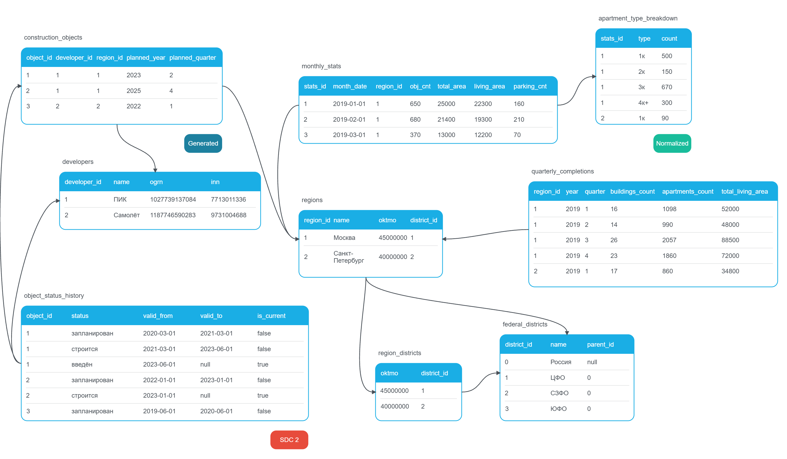

# building_database
Создание базы данных по строительству в России за 2019-2026 год и последующая работа с ней.
Данные взяты с порталов ДОМ.РФ, "Если быть точным", а часть таблиц (construction_objects и object_status_history) сгенерированы искусственно из-за нехватки открытых источников.

## Логическая модель
Всего реализовано 8 связанных таблиц. Ниже прикреплено визуальное представление проекта.

## Описание таблиц

### developers
Таблица *developers* содержит информацию о застройщике: суррогатный id, название, ОГРН, ИНН. 
Столбец id был создан, потому что данные взяты из нескольких источников, где названия застройщиков указаны неточно или слишком точно (например, с указанием региона). С помощью этого ключа позже можно будет упорядочить застройщиков и сделать данные максимально точными, это является одним из путей развития проекта. Пока что, если застройщик не был найден в таблице developers по имени, связанные данные не вставлялись в итоговые таблицы.

### regions
Таблица *regions* содержит информацию о регионе - суррогатный id, его название, код ОКТМО, индекс федерального округа. Здесь искусственный ключ нужен по той же причине - в разных таблицах даже одного источника регион задается по-разному (код региона, код ОКТМО, название в разных форматах), поэтому id является связующим звеном между большинством таблиц.

### federal_districts 
Небольшая таблица *federal_districts* написана вручную: в ней есть только id и название федерального округа. Она создана, можно сказать, искусственно, чтобы закрыть требование к рекурсвиным вызовам. 

### region_districts
Таблица *region_districts* содержит в себе код ОКТМО и номер ФО, чтобы корретно сопоставить регион и его округ. 

### construction_objects
Таблица *construction_objects* сгенерирована самостоятельно на основе таблицы developers. В ней содержится информация о запланированных объектах строительства. Из исходной таблицы data_housing_construction_dev.csv были выбраны уникальные пары застройщик-регион и, основываясь на них, составлены столбцы planned_year и planned_quarter - плановый год и квартал сдачи объекта. 

### object_status_history
Таблица *object_status_history* представляет из себя форму SDC 2. В ней отображены статусы строительства различных объектов. Она генерировалась на основе construction_objects, даты наала планирования, строительства и сдачи тоже генерировались рандомно. 

### monthly_stats

Таблица *monthly_stats* отображает ежемесячную статистику запусков объектов в разрезе субъектов России. Туда включены основные показатели: дата, id региона, количество запущенных квартир, общая жилая площадь и количество парковочных мест в новых объектах. Каждой записи в таблице присвоен уникальный номер stats_id: он связывает эту таблицу с *apartment_type_breakdown* -  разбивкой записей по типу квартиры.

### apartment_type_breakdown
Таблица *apartment_type_breakdown* является продуктом нормализации формы 2 изначальной таблицы с месячной статистикой по региону. По ней можно отследить какое количество какого типа квартир было запущено исходя из stats_id.

### quarterly_completions
Таблица *quarterly_completions* содержит похожую информацию на ту, что лежит в *montly_stats*, но идет по кварталам. Помимо этого там содержится buildings_count - количество запущенных объектов в квартале. Это может пригодиться лдля отслеживания динамики строительства по кварталам.
